# Zenith Banking App (Expo)

A front-end clone of the Zenith Bank mobile banking app, built with Expo, React Native, and TypeScript. It recreates the layout and navigation of seven real screens: Welcome, Login, Home, Transfer, Airtime & Data, Bills, and Menu.

There is no backend. All data is mock data, and login is a mock so the app can be reviewed without credentials.

Built for SAIT (Mobile App Development) as the "Advanced Multi-Screen Mobile Application" project.

> **Educational project, not affiliated with Zenith Bank, Dangote, or Quickteller.** Brand names and logos belong to their owners and are used for illustration only. The Welcome background photo is AI-generated, and every person's name in the app is invented.

## Contents

1. [Screenshots](#screenshots)
2. [Quick start](#quick-start)
3. [Demo guide](#demo-guide)
4. [How the app works](#how-the-app-works)
5. [Screen by screen](#screen-by-screen)
6. [Components](#components)
7. [Component organization rules](#component-organization-rules)
8. [Data and helpers](#data-and-helpers)
9. [Theme](#theme)
10. [Project structure](#project-structure)
11. [Assignment requirements checklist](#assignment-requirements-checklist)
12. [Scope and limitations](#scope-and-limitations)
13. [Verification](#verification)
14. [Development log](#development-log)

## Screenshots

Each screen is shown twice: first the real Zenith Bank app (reference), then this clone running in Expo Go on an iPhone. The files live in `assets/images/screenshots`.

### Reference (the real app)

|                                            Welcome                                             |                                           Login                                            |                                           Home                                           |                                             Transfer                                             |
| :--------------------------------------------------------------------------------------------: | :----------------------------------------------------------------------------------------: | :--------------------------------------------------------------------------------------: | :----------------------------------------------------------------------------------------------: |
| 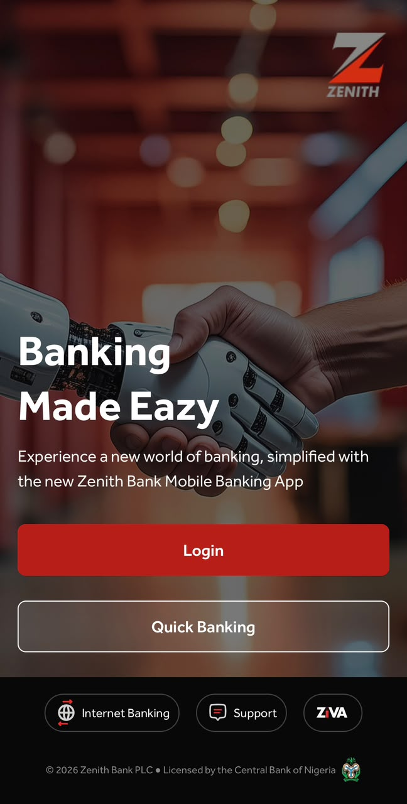 | 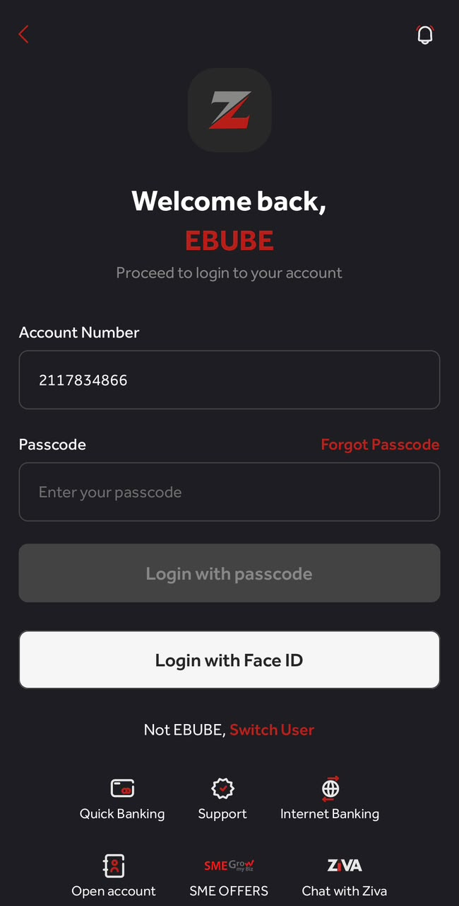 | 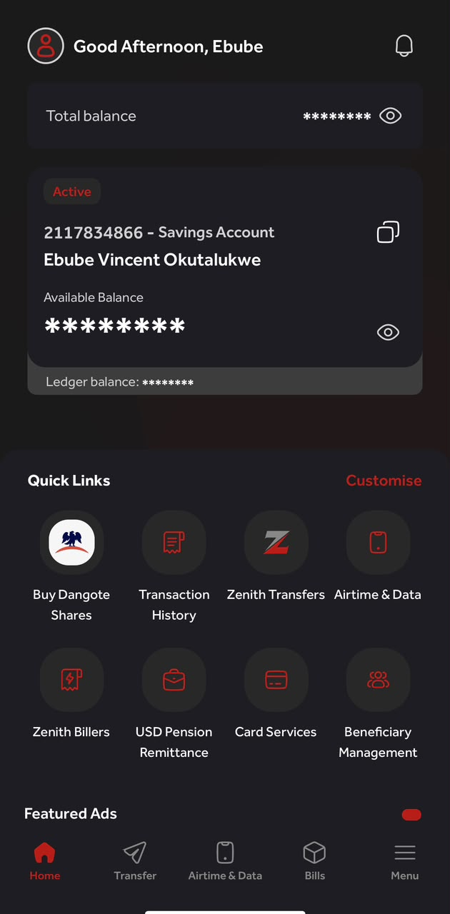 | 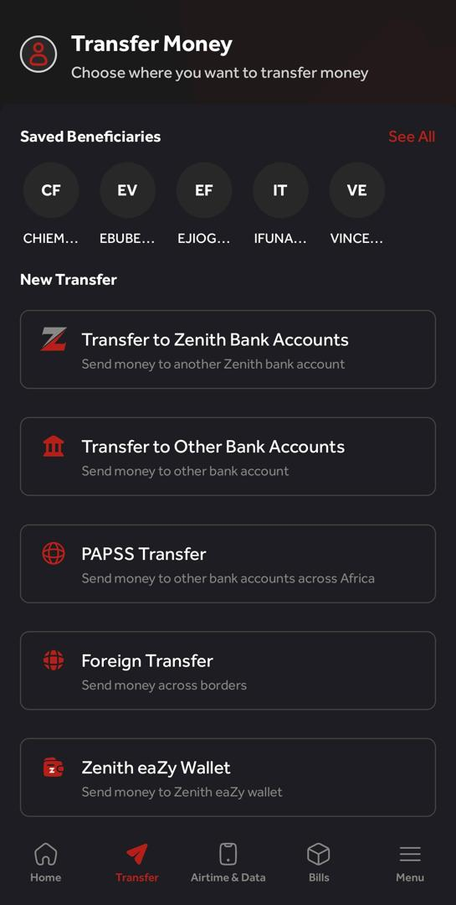 |

|                                             Airtime & Data                                              |                                           Bills                                            |                                           Menu                                           |
| :-----------------------------------------------------------------------------------------------------: | :----------------------------------------------------------------------------------------: | :--------------------------------------------------------------------------------------: |
| 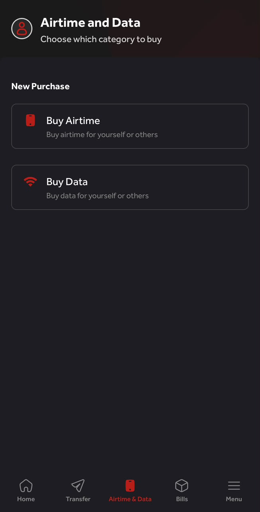 | 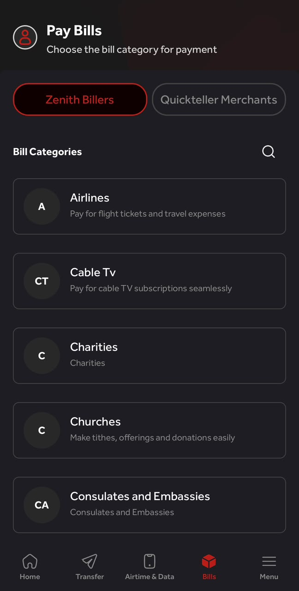 | 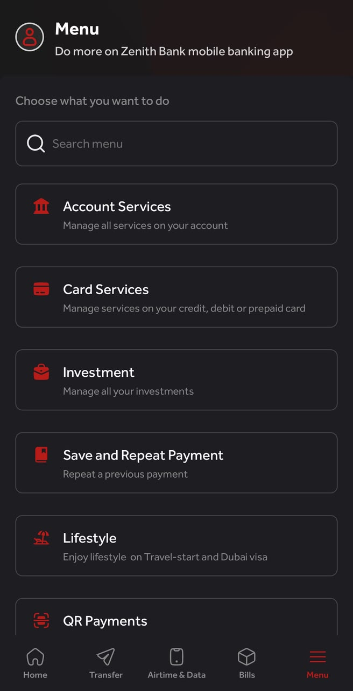 |

### This app (the clone)

|                                          Welcome                                           |                                         Login                                          |                                         Home                                         |                                           Transfer                                           |
| :----------------------------------------------------------------------------------------: | :------------------------------------------------------------------------------------: | :----------------------------------------------------------------------------------: | :------------------------------------------------------------------------------------------: |
| 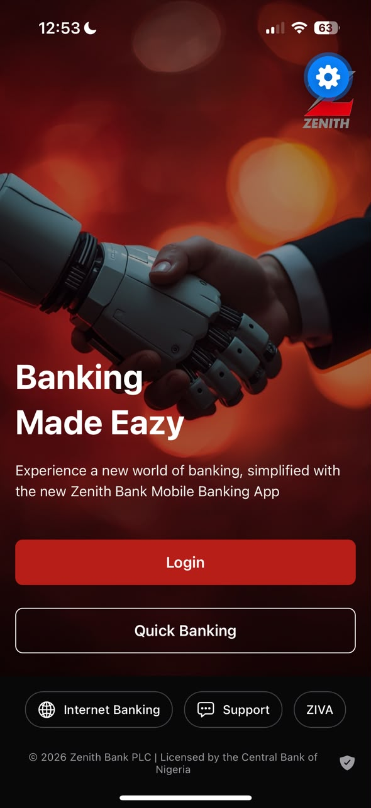 | 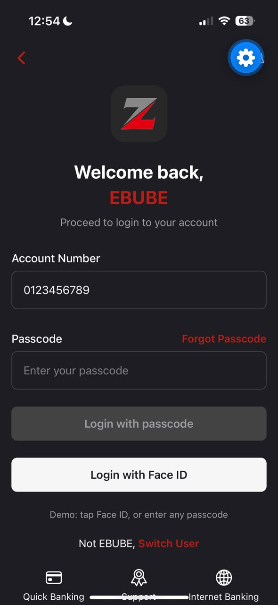 | 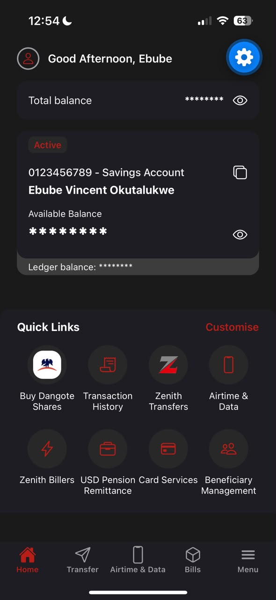 | 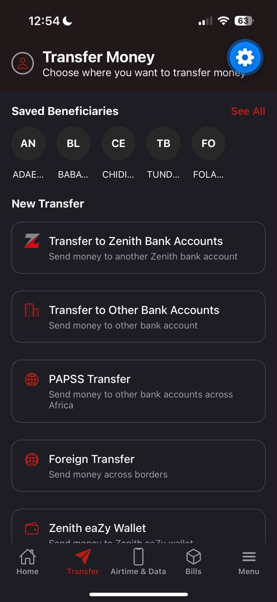 |

|                                           Airtime & Data                                            |                                         Bills                                          |                                         Menu                                         |
| :-------------------------------------------------------------------------------------------------: | :------------------------------------------------------------------------------------: | :----------------------------------------------------------------------------------: |
| 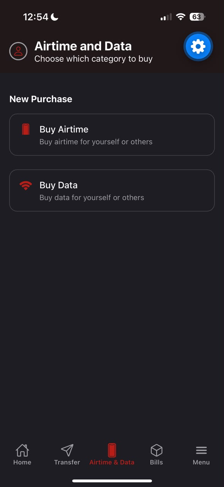 | 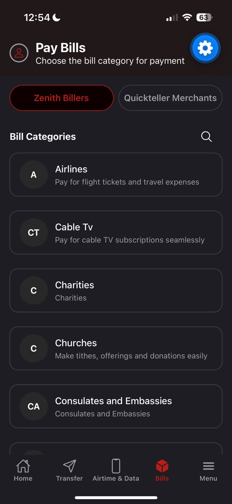 | 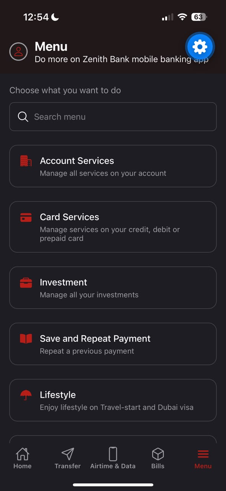 |

> The small blue gear visible on some clone screenshots is Expo Go's developer-tools button. It is not part of the app.

## Quick start

**Prerequisites:** Node.js (current LTS), and the **Expo Go** app on a phone (iOS or Android).

```bash
npm install
npx expo start
```

Then scan the QR code in the terminal with the phone's camera (iOS) or inside Expo Go (Android).

| Situation                                                  | What to do                                         |
| ---------------------------------------------------------- | -------------------------------------------------- |
| Phone and computer are on the same Wi-Fi                   | `npx expo start`                                   |
| The phone can't connect (different network, firewall, VPN) | `npx expo start --tunnel`                          |
| Android emulator                                           | Start the emulator, then press `a` in the terminal |
| Browser (quick layout checks only)                         | Press `w` in the terminal                          |

After adding a new file, if the phone still shows the old screen, press `r` in the Expo terminal to reload.

## Demo guide

**Logging in without a password:** on the Login screen, tap **Login with Face ID**, or type any character in the passcode field and tap **Login with passcode**. Nothing is checked, and nothing is stored.

Things worth trying:

| Where    | Try this                                                                                                 |
| -------- | -------------------------------------------------------------------------------------------------------- |
| Welcome  | Tap **Login**. **Quick Banking** is intentionally inactive.                                              |
| Login    | Watch the passcode button turn from grey to red once something is typed.                                 |
| Home     | Tap either eye icon: all three balances show or hide together.                                           |
| Home     | In Quick Links, tap **Zenith Transfers**, **Airtime & Data**, or **Zenith Billers** to jump to that tab. |
| Transfer | Scroll the content: the header stays fixed.                                                              |
| Bills    | Switch between **Zenith Billers** and **Quickteller Merchants**: the list changes and starts at the top. |
| Menu     | Type in the search box (for example `card`, `QR`, or `zzz`): the list filters as you type.               |

There is no log-out. To see Welcome again, reload the app.

## How the app works

### Routing: one file is one screen

The app uses **Expo Router** (file-based routing). Every file inside `src/app` becomes a screen, and a folder in parentheses, such as `(tabs)`, groups screens without adding to the address.

```
src/app/
  _layout.tsx        root stack: decides how the top-level screens connect
  index.tsx          Welcome   (address: /)
  login.tsx          Login     (address: /login)
  (tabs)/
    _layout.tsx      the tab bar
    home.tsx         /home
    transfer.tsx     /transfer
    airtime.tsx      /airtime
    bills.tsx        /bills
    menu.tsx         /menu
```

Welcome is `index.tsx` and Home is `home.tsx`, not `index.tsx`, because two files named `index` would both claim the `/` address and conflict.

### Navigation: a stack containing a tab bar

The app has two layers of navigation:

1. **The root stack** (`src/app/_layout.tsx`) holds Welcome, Login, and the whole tab group. Screens move forward and back like a pile of cards. The stack's own header is switched off (`headerShown: false`), because each screen draws its own header to match the reference.
2. **The tab bar** (`src/app/(tabs)/_layout.tsx`) holds the five main screens: Home, Transfer, Airtime & Data, Bills, and Menu.

The flow:

```
Welcome --push--> Login --replace--> Tabs (Home | Transfer | Airtime & Data | Bills | Menu)
```

| Move                     | Method                    | Why                                                                                                   |
| ------------------------ | ------------------------- | ----------------------------------------------------------------------------------------------------- |
| Welcome to Login         | `router.push("/login")`   | Stacks Login on top, so the back chevron returns to Welcome.                                          |
| Login to Home            | `router.replace("/home")` | Swaps Login out of the history, so there is no way back to Login from Home, as in a real banking app. |
| Home Quick Link to a tab | `router.navigate(route)`  | Switches to the tab instead of stacking a second copy of it.                                          |
| Login back chevron       | `router.back()`           | Pops Login off the stack.                                                                             |

**Tab bar details:** each tab has an outlined icon when idle and a filled one when selected, chosen from the navigator's `focused` flag (Menu has no filled hamburger, so only its color changes). The bar is flat, the same color as the page, with no border or shadow. The tab scenes have an explicit dark background so they don't fall back to the library's default light page color.

### State: local and minimal

No global store is used, because nothing needs one. Each screen keeps only the state it owns:

| Screen | State                       | Holds                                                 |
| ------ | --------------------------- | ----------------------------------------------------- |
| Login  | `accountNumber`, `passcode` | The two text fields (controlled inputs).              |
| Home   | `balancesVisible`           | One flag that drives every amount on the screen.      |
| Bills  | `source`                    | Which list is showing: `"zenith"` or `"quickteller"`. |
| Menu   | `query`                     | What is typed in the search box.                      |

Anything that can be worked out from state is **calculated on each render and never stored**, so it can't go out of date:

```ts
// Login: is the passcode button enabled?
const canSubmit = passcode.length > 0;

// Menu: which cards match the search?
const results = menuOptions.filter(({ title, subtitle }) =>
  `${title} ${subtitle}`.toLowerCase().includes(query.trim().toLowerCase()),
);
```

### Data: lists live in files, screens only draw them

Every list in the app (Quick Links, beneficiaries, transfer options, bill categories, menu items, and more) is a typed array in `src/data`. A screen does not contain the content, it loops over the data and draws one component per item:

```tsx
{
  transferOptions.map(({ id, ...option }) => (
    <OptionCard key={id} {...option} />
  ));
}
```

Adding a menu item or a bill category is one new line in a data file, with no screen code changed. Four screens share one item shape, `OptionItem` in `src/types.ts`, so their data is interchangeable.

### Patterns used throughout

| Pattern                 | What it is                                                                                              | Example                                                                                                           |
| ----------------------- | ------------------------------------------------------------------------------------------------------- | ----------------------------------------------------------------------------------------------------------------- |
| **Variants**            | A prop limited to a few words picks a look. A string-keyed style lookup (`styles[variant]`) applies it. | `AppButton` (`primary`, `outline`, `light`), `Card` (`filled`, `outlined`), `ScreenHeader` (`titled`, `greeting`) |
| **Slots**               | A `ReactNode` prop lets the caller supply whatever element goes in one spot.                            | `ScreenHeader` `right`, `SectionHeader` `right`, `TextField` `labelAction`, `OptionCard` `leading`                |
| **Derived values**      | Calculated from state during render, never stored.                                                      | `canSubmit`, `results`, each pill's `active` flag                                                                 |
| **Caller-wins `style`** | A component accepts a `style` prop that is applied last, so callers can adjust layout.                  | `Card`                                                                                                            |
| **Type-checked unions** | A typo in a fixed set of words is a compile error.                                                      | `BillSource`, button `variant`, `IconName`                                                                        |
| **`Record` data**       | Guarantees there is exactly one entry per allowed key.                                                  | `billCategories: Record<BillSource, OptionItem[]>`                                                                |

## Screen by screen

### Welcome (`src/app/index.tsx`)

Photo background with a dark overlay, the logo at the top right, the headline "Banking Made Eazy", and two buttons. A black footer holds three pills and a legal line.

- `ImageBackground` fills the screen. A separate overlay `View` darkens the photo so white text stays readable.
- `useSafeAreaInsets()` pads the content below the notch and above the home bar, using each phone's real values.
- **Login** pushes the Login screen. **Quick Banking** is intentionally inactive, because the guest flow is out of scope.
- The footer pills are drawn from `welcomeShortcuts`. `ShortcutPill` lives in this file because it is small and used only here.

### Login (`src/app/login.tsx`)

Header row, logo tile, a two-color greeting, two fields, two buttons, a "Switch User" line, and a grid of six shortcuts.

- **Mock authentication:** both login buttons call the same `handleLogin`, which runs `router.replace("/home")`. Any passcode is accepted and nothing is stored.
- **Real Face ID is deliberately not used.** It needs a device with enrolled biometrics, so on an emulator or an unenrolled phone it would fail and look broken. The mock cannot fail.
- The passcode button is **disabled** until `passcode.length > 0` (a value calculated from state), and the label on the white button has dark text so it stays readable.
- `ScrollView` plus `KeyboardAvoidingView` keep the buttons reachable when the keyboard opens. `keyboardShouldPersistTaps="handled"` makes a button work on the first tap even while the keyboard is up.
- "Switch User" is a `LinkText` nested inside a sentence. This works because `LinkText` is built on `Text`, not `Pressable`.
- Shortcuts come from `loginShortcuts`. SME Grow and ZIVA are brand logos with no artwork available, so they appear as bold text stand-ins.
- A small line on the screen ("Demo: tap Face ID, or enter any passcode") tells a reviewer how to get in.

### Home (`src/app/(tabs)/home.tsx`)

A greeting header with a bell, a total-balance row, an account card with a ledger strip, and a Quick Links panel.

- The greeting comes from `getGreeting()`, so it reads Morning, Afternoon, or Evening depending on the phone's clock.
- **One flag, `balancesVisible`, drives all three amounts.** Both eye icons call the same toggle, and `formatBalance(amount, visible)` returns either `********` or formatted currency. Balances start hidden, as in the reference.
- **The ledger strip** is a separate view pulled up behind the card with a negative top margin. `zIndex` on the card keeps the card on top, so only the strip's bottom edge and rounded corners show. This reproduces the "tucked under" look.
- The page color (`backdrop`) is darker than the cards, so the cards read as raised. The Quick Links panel is a full-width sheet with rounded top corners.
- Eight Quick Links are drawn from `quickLinks`. Three have a `route` and switch to a tab: Zenith Transfers, Airtime & Data, and Zenith Billers. The other five are display-only, and `QuickLinkItem` ignores taps and doesn't dim when no handler is given.
- The Dangote logo is made for a light background, so `imageBadge` places it on a white rounded square inside the dark tile.
- The bell, the copy icon, and "Customise" are static. Copying to the clipboard would need an extra package that the assignment doesn't call for.

### Transfer (`src/app/(tabs)/transfer.tsx`)

A fixed header, a row of saved beneficiaries, and five transfer option cards.

- The header sits outside the scrolling area so it stays put while the content scrolls.
- Beneficiaries scroll horizontally. Each is an `Avatar` whose initials come from `getInitials(name)`, with an uppercase label cut off by `numberOfLines={1}`. The data holds only names, since initials and the uppercase label are derived.
- The five option cards come from `transferOptions`. The first one uses the Zenith logo image, and the rest use Ionicons.
- Cards are display-only. "See All" is a static link.

### Airtime & Data (`src/app/(tabs)/airtime.tsx`)

A header, one section title, and two cards (Buy Airtime, Buy Data) drawn from `purchaseOptions`. It uses a plain `View` and not a `ScrollView`, because two cards fit on any phone. It is built entirely from existing components.

### Bills (`src/app/(tabs)/bills.tsx`)

A header, a two-pill toggle, a "Bill Categories" heading, and a scrolling list of categories.

- `useState<BillSource>("zenith")` stores which list shows. The type allows only `"zenith"` or `"quickteller"`.
- The pills are drawn from `billSources`, and each pill's `active` flag is `id === source`, calculated and never stored.
- `billCategories` is a `Record<BillSource, OptionItem[]>`, so every possible source is guaranteed to have a list, and `billCategories[source]` cannot be empty.
- The list is a `FlatList`, which builds only the visible rows. `key={source}` makes React rebuild the list when the pill changes, so each list starts at the top.
- Each card gets an initials circle through `OptionCard`'s `leading` slot. The data stores no initials.
- The pills and heading sit outside the list so they stay fixed while the cards scroll.
- Pill labels use `adjustsFontSizeToFit` as a safety net, so a long label shrinks slightly on a narrow phone instead of being cut off.
- The search icon is decorative.

### Menu (`src/app/(tabs)/menu.tsx`)

A header, an instruction line, a search box, and a list of nine option cards.

- **Live search:** `query` holds the typed text, and the visible cards are calculated from it on every render. Text is trimmed and lowercased, and it is matched against title and subtitle together. An empty search shows everything with no special case, because `"text".includes("")` is always true.
- **The search box is outside the `FlatList`.** A text field inside a list header that redraws on every keystroke can be rebuilt and lose focus, closing the keyboard after each letter.
- `ListEmptyComponent` shows "No results for ..." instead of a blank screen.
- Cards are display-only. `SearchBar` stays in this file because it is small and used once.

## Components

Everything in `src/components` is shared by two or more screens, or is large enough to deserve its own file.

| Component       | Purpose                                                  | Main props                                                                |
| --------------- | -------------------------------------------------------- | ------------------------------------------------------------------------- |
| `AppButton`     | Pressable button with a fade on press                    | `label`, `onPress`, `variant` (`primary`, `outline`, `light`), `disabled` |
| `Avatar`        | Circle with initials computed from a name                | `name`, `size` (default 48)                                               |
| `Card`          | Rounded surface; the base for other cards                | `children`, `variant` (`filled`, `outlined`), `style`                     |
| `LinkText`      | Red tappable text that can sit inside a sentence         | `label`, `onPress`                                                        |
| `OptionCard`    | Outlined card with a leading visual, title, and subtitle | `title`, `subtitle`, `icon`, `image`, `leading`, `onPress`                |
| `QuickLinkItem` | Circular tile with a label for Home's grid               | `label`, `icon`, `image`, `imageBadge`, `onPress`                         |
| `ScreenHeader`  | Profile icon with a title, subtitle, and right-hand slot | `title`, `subtitle`, `right`, `variant` (`titled`, `greeting`)            |
| `SectionHeader` | Bold title with an optional right-hand element           | `title`, `right`                                                          |
| `TextField`     | Labeled input; accepts any `TextInput` prop              | `label`, `labelAction`, plus all `TextInputProps`                         |
| `ZenithLogo`    | Brand mark, with or without the wordmark                 | `size`, `showWordmark`                                                    |

Every component has a typed props object (`type XProps = { ... }`), and optional props have defaults where a default makes sense.

## Component organization rules

The project asks when a component gets its own file and when it stays in its parent. The rule used throughout:

| Situation                                                | Where it lives                   | Examples                                                                                      |
| -------------------------------------------------------- | -------------------------------- | --------------------------------------------------------------------------------------------- |
| Used on more than one screen                             | Its own file in `src/components` | `OptionCard` (Transfer, Airtime, Bills, Menu), `Card`, `ScreenHeader`, `Avatar`               |
| Large, or has its own types and logic, even if used once | Its own file                     | `QuickLinkItem` (two ways to render, its own props), `TextField`                              |
| Small and used by only one screen                        | Inside that screen's file        | `EyeButton`, `ShortcutPill`, `ShortcutGridItem`, `SourcePill`, `SearchBar`, `BeneficiaryItem` |

**Conventions**

- Components are PascalCase and use **named exports**. Screens use **default exports**, because the router requires them.
- File names match the component name, with a capital first letter, so the project also works on case-sensitive systems.
- Props are typed with `type XProps`. Prop types that mirror data are borrowed from the data type (`Pick<QuickLink, ...>`) so the two cannot drift apart.
- `StyleSheet.create` sits at the bottom of each file. A style that depends on a prop or on the phone (safe-area insets, an avatar's size) is applied inline next to the fixed styles.
- No colors, spacing values, radii, or font sizes are hard-coded in components. They come from `src/theme.ts`.
- Comments are short and explain why, not what.

## Data and helpers

### Data (`src/data`)

| File                 | Contents                                                      | Used by        |
| -------------------- | ------------------------------------------------------------- | -------------- |
| `user.ts`            | The mock user: name, account number, status, balances         | Login, Home    |
| `shortcuts.ts`       | `welcomeShortcuts` (footer pills) and `loginShortcuts` (grid) | Welcome, Login |
| `quickLinks.ts`      | Eight Quick Links, three with a tab route                     | Home           |
| `beneficiaries.ts`   | Five invented beneficiaries (`id`, `name`)                    | Transfer       |
| `transferOptions.ts` | Five transfer option cards                                    | Transfer       |
| `purchaseOptions.ts` | Buy Airtime and Buy Data                                      | Airtime & Data |
| `billCategories.ts`  | `BillSource`, `billSources`, and the two category lists       | Bills          |
| `menuOptions.ts`     | Nine menu items                                               | Menu           |

The first five Zenith bill categories, the first five Menu items, and all labels on the screens come from the reference. The remaining entries in those lists are invented so toggles and search have something to work with.

### Helpers (`src/utils`)

Plain functions with no React in them, so each can be reused and tested on its own.

| Function                         | Behavior                                                              | Examples                                                                           |
| -------------------------------- | --------------------------------------------------------------------- | ---------------------------------------------------------------------------------- |
| `getGreeting(hour?)`             | Time-based greeting. Defaults to the current hour.                    | 6 gives "Good Morning", 12 gives "Good Afternoon", 17 gives "Good Evening"         |
| `formatBalance(amount, visible)` | Masks the amount, or formats it as Naira with commas and two decimals | `(482350.75, true)` gives `₦482,350.75`; `(482350.75, false)` gives `********`     |
| `getInitials(name)`              | First letter of the first two words, uppercased                       | "Cable Tv" gives `CT`, "Airlines" gives `A`, "Consulates and Embassies" gives `CA` |

Money is stored as a plain `number`, which is fine for display in a mock. A real banking app would store whole integers in the smallest currency unit (kobo) because floating-point decimals can drift.

### Shared types (`src/types.ts`)

- `IconName`: the set of valid Ionicons names, taken from the library's own type, so a wrong icon name is a compile error.
- `OptionItem`: the shape shared by every list drawn with `OptionCard` (`id`, `title`, `subtitle`, and optionally `icon` or `image`).

## Theme

`src/theme.ts` is the single source for every visual value. The values were measured and sampled from the reference screenshots.

| Group      | Tokens                                                                                                                                                                                            |
| ---------- | ------------------------------------------------------------------------------------------------------------------------------------------------------------------------------------------------- |
| `colors`   | `background`, `backdrop`, `headerBackground`, `surface`, `surfaceRaised`, `border`, `primary`, `primaryDark`, `black`, `overlay`, `white`, `offWhite`, `textMuted`, `textPlaceholder`, `disabled` |
| `spacing`  | `xs` 4, `sm` 8, `md` 12, `lg` 16, `xl` 24, `xxl` 32                                                                                                                                               |
| `radius`   | `sm` 8, `md` 14, `lg` 20, `pill` 999                                                                                                                                                              |
| `fontSize` | `small` 11, `caption` 13, `body` 15, `subtitle` 16, `title` 22, `heading` 26, `amount` 30, `display` 36                                                                                           |

Changing a token changes every screen that uses it. For example, the brand red is one value in `colors.primary`, and "Forgot Passcode", "Customise", the selected tab, and the Active badge all follow it.

**Consistency check:** this command searches the source (outside the theme file) for hard-coded colors. It should print nothing.

```powershell
Get-ChildItem src -Recurse -Include *.ts,*.tsx | Select-String -Pattern "#[0-9A-Fa-f]{3,8}\b|rgba?\(" | Where-Object { $_.Path -notmatch "theme.ts" }
```

## Project structure

```
.
├── assets/
│   └── images/
│       ├── welcome-bg.jpeg
│       ├── zenith-logo.png        Z with wordmark (Welcome)
│       ├── zenith-mark.png        Z alone (Login, Quick Links)
│       ├── dangote-mark.png       emblem only (Quick Links)
│       └── screenshots/               ref-* = real app, app-* = this clone
├── src/
│   ├── app/                       screens and layouts (see "How the app works")
│   ├── components/                shared components
│   ├── data/                      mock data
│   ├── utils/                     getGreeting, formatBalance, getInitials
│   ├── theme.ts                   colors, spacing, radius, font sizes
│   └── types.ts                   shared types
├── app.json
├── package.json
└── tsconfig.json
```

## Assignment requirements checklist

| Requirement                                                 | Where it is met                                                                                  |
| ----------------------------------------------------------- | ------------------------------------------------------------------------------------------------ |
| Real app with moderate interface complexity                 | Zenith Bank mobile banking app, seven distinct screens captured                                  |
| Screenshots of at least three related screens               | Seven, in `assets/images/screenshots` (the `ref-` files)                                         |
| Expo project, TypeScript template                           | Created with `create-expo-app` and TypeScript throughout                                         |
| Minimum four functional screens                             | Seven: Welcome, Login, Home, Transfer, Airtime & Data, Bills, Menu                               |
| Tab navigation combined with at least one stack flow        | Five tabs, plus a root stack carrying Welcome, Login, and the tabs                               |
| Structured layout, icons, consistent styling                | Ionicons throughout, with every value from `theme.ts`                                            |
| Dynamic content (lists, parameters, or reusable components) | Data-driven lists on Welcome, Login, Home, Transfer, Bills, and Menu, plus ten shared components |
| Reusable and large code split into components               | `src/components`; see the organization rules above                                               |
| Decision making for component organization                  | The rule table above, applied across every screen                                                |
| Consistent conventions                                      | PascalCase components, named exports, default exports for screens, one pattern for every list    |
| TypeScript prop definitions                                 | Every component has a typed props object                                                         |
| Pushed to GitHub                                            | Committed milestone by milestone with descriptive messages                                       |
| Bonus: mock authentication                                  | The mock login flow (Face ID or any passcode)                                                    |

## Scope and limitations

**Intentionally inactive** (the destinations don't exist in this clone, and the elements are display-only):
Quick Banking, Forgot Passcode, Switch User, the bell, the copy icon, Customise, See All, the Bills search icon, the Login and Welcome shortcuts, five of the eight Quick Links, and the option cards on Transfer, Airtime & Data, Bills, and Menu.

**Differences from the reference**

- Headers use a flat color where the reference has a very subtle gradient.
- Text uses the platform's system font, not the bank's own typeface.
- Brand artwork for SME Grow and ZIVA is replaced by text stand-ins.
- The reference's Featured Ads strip is omitted. It is only a title and an indicator pill cut off at the screen edge.
- The Welcome photo is a different image from the original.

**Other notes**

- There is no persistence: closing the app resets everything, including the balance visibility toggle.
- Nothing is validated and nothing is sent anywhere.
- Platform status: iOS has been tested through Expo Go. Android: update this line after testing.

## Verification

```bash
npx tsc --noEmit
```

Type-checks every file without running or building anything. No output means no errors. This was run before each push.

## Development log

The project was built in milestones, each tested on a phone and pushed as a few small commits.

| #   | Milestone        | What was built and decided                                                                                                                                                                                                                                                                   |
| --- | ---------------- | -------------------------------------------------------------------------------------------------------------------------------------------------------------------------------------------------------------------------------------------------------------------------------------------- |
| 1   | Foundation       | Cleared the Expo template. Root stack plus five tabs, `theme.ts`, mock user. Fixed: tab icon colors use React Native's `ColorValue` type, not `string`, and Expo's generated route list was stale after the template reset (a dev-server restart regenerates it).                            |
| 2   | Welcome          | `AppButton`, `ZenithLogo`, footer pills from data, safe-area insets. Extracted the shared `IconName` type. The Zenith logo file had a solid white background, so a transparent version was made.                                                                                             |
| 3   | Login            | Mock authentication, `LinkText`, `TextField`, a `disabled` state and a `light` variant on `AppButton`, scrolling and keyboard handling. TypeScript caught a missing `textPlaceholder` theme color before the app ran.                                                                        |
| 4   | Home and tab bar | `Card`, `ScreenHeader`, `SectionHeader`, `QuickLinkItem`, the balance toggle, the greeting and money helpers, and filled-icon tabs. Fixed: tab scenes defaulted to a light page color, and the Home backdrop had to be darker than the cards.                                                |
| 5   | Transfer         | `Avatar`, `getInitials`, `OptionCard`, and the shared `OptionItem` type.                                                                                                                                                                                                                     |
| 6   | Airtime & Data   | Built entirely from existing components, with one new data file. Fixed: the "Airtime & Data" tab label was truncating.                                                                                                                                                                       |
| 7   | Bills            | A typed toggle, `FlatList`, and the `leading` slot on `OptionCard`. Fixed: the right pill label was cut off. Comparing text widths with the reference showed its font is slightly smaller, so the label size and padding were adjusted and `adjustsFontSizeToFit` was added as a safety net. |
| 8   | Menu             | Live search with a derived result list, an empty state, and keyboard handling.                                                                                                                                                                                                               |
